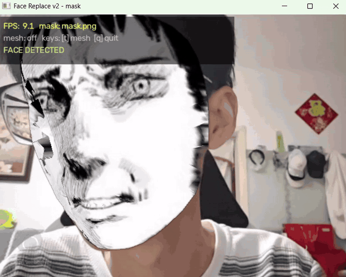

# 阿格尼痛苦脸 · 实时人脸替换特效



一个基于 OpenCV 与 MediaPipe Face Landmarker 的课程实践项目：将漫画线稿或其他人脸素材实时贴合到摄像头中的人脸上，并对比全局仿射与分片非刚性变形两种实现。

## 效果与实现

- `app/basic.py`：使用 6 对关键点估计相似变换，完成整体缩放、旋转和平移。
- `app/nonrigid.py`：使用 468 个人脸关键点进行 Delaunay 三角剖分，对每个三角形分别执行仿射变换，以跟随眉毛、嘴角等局部动作。
- `tools/`：包含 6 点标注工具与 468 点检测稳定性验证工具。
- `reports/`：保留完整实践报告、项目汇报 PPT 及报告引用图片。

更完整的推导、调试过程与迭代记录见 [实践报告](reports/实践报告.md)。

## 目录结构

```text
.
├── app/
│   ├── basic.py                 # v1：全局仿射
│   └── nonrigid.py              # v2：Delaunay + 分片仿射
├── assets/
│   ├── face-swap-demo.gif       # README 顶部效果演示
│   └── masks/                   # mask 素材与 6 点标注数据
├── tools/
│   ├── annotate_mask.py         # 6 点可视化标注工具
│   └── validate_landmarks.py    # 468 点检测稳定性验证
├── reports/
│   ├── 实践报告.md
│   ├── 项目汇报.pptx
│   └── images/
├── requirements.txt
└── README.md
```

## 环境准备

建议使用 Python 3.10 或 3.11，并准备一个可用摄像头。

```bash
python -m venv .venv
# Windows
.venv\Scripts\activate
# macOS / Linux
source .venv/bin/activate

pip install -r requirements.txt
```

下载 MediaPipe Face Landmarker 模型并放到仓库根目录，文件名保持为 `face_landmarker.task`：

<https://storage.googleapis.com/mediapipe-models/face_landmarker/face_landmarker/float16/1/face_landmarker.task>

模型约 3.7 MB，可重复下载，因此默认不纳入 Git。

## 运行

全局仿射版：

```bash
python app/basic.py
```

非刚性变形版（推荐）：

```bash
python app/nonrigid.py
python app/nonrigid.py --mask mask1.png
python app/nonrigid.py --mesh
```

常用参数：

| 参数 | 说明 |
| --- | --- |
| `--camera 0` | 摄像头索引，默认 `0` |
| `--mask mask.png` | `assets/masks` 中的文件名，也可传相对或绝对路径 |
| `--mesh` | 显示 Delaunay 三角网格 |
| `--no-feather` | 关闭 Alpha 羽化 |

运行时按 `t` 切换三角网格，按 `q` 退出。

## 辅助工具

编辑 v1 使用的 6 个关键点：

```bash
python tools/annotate_mask.py
```

验证 MediaPipe 在 mask 上检测 468 点的稳定性：

```bash
python tools/validate_landmarks.py
python tools/validate_landmarks.py --save
```

带 `--save` 时，结果写入 `outputs/landmark_test_output/`，该目录默认不提交。

## 技术栈

- OpenCV：摄像头读取、图像变换与 Alpha 合成
- MediaPipe：实时人脸关键点检测
- NumPy / SciPy：矩阵计算与 Delaunay 三角剖分
- Pillow：标注工具中的中文绘制

## 说明

本项目用于数字图像处理课程实践与个人项目展示。仓库目前未附开源许可证；在补充许可证前，默认保留全部权利。
