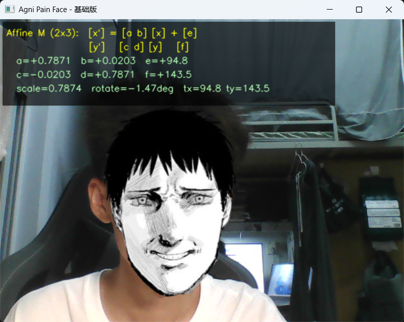
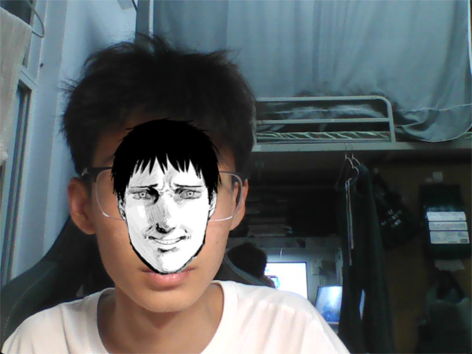
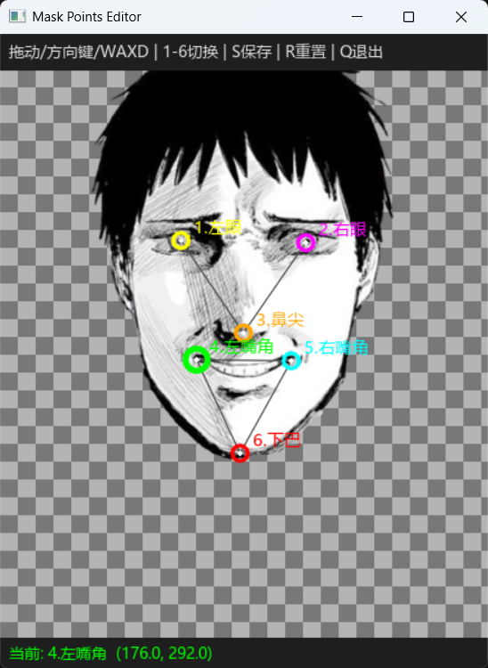
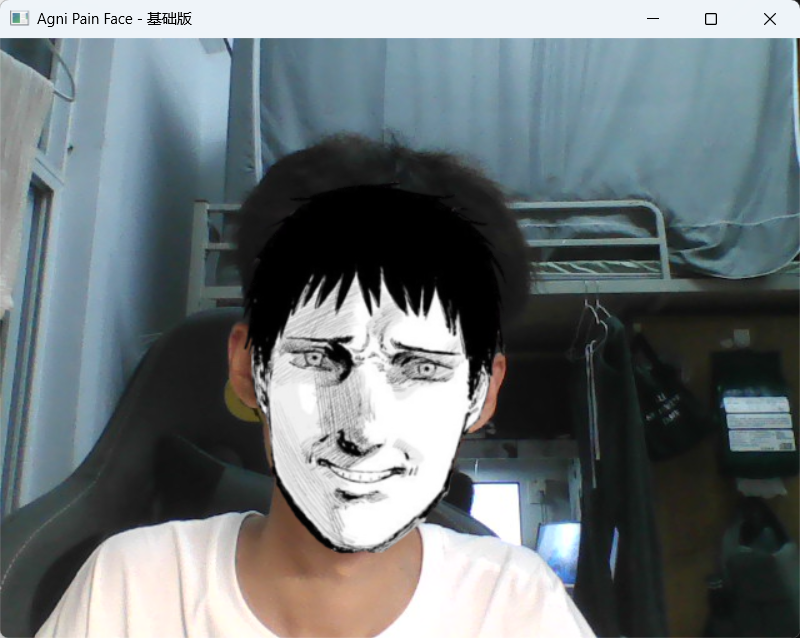
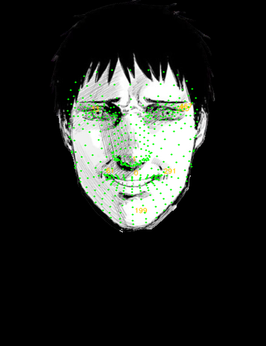
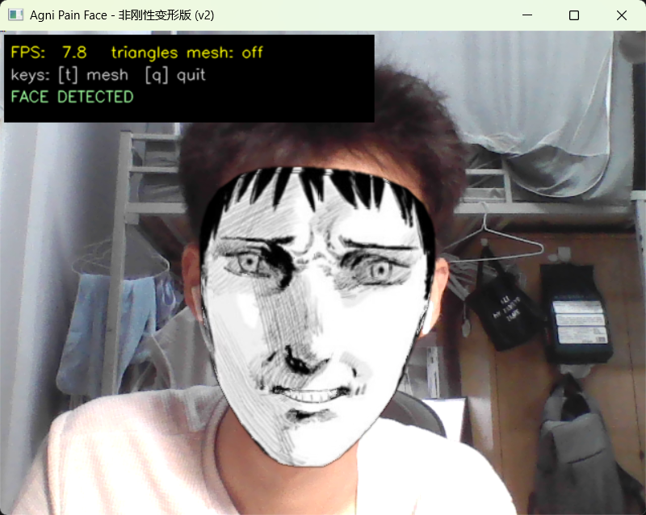
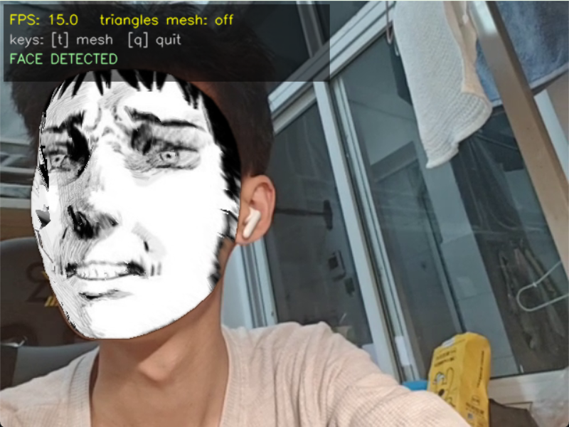
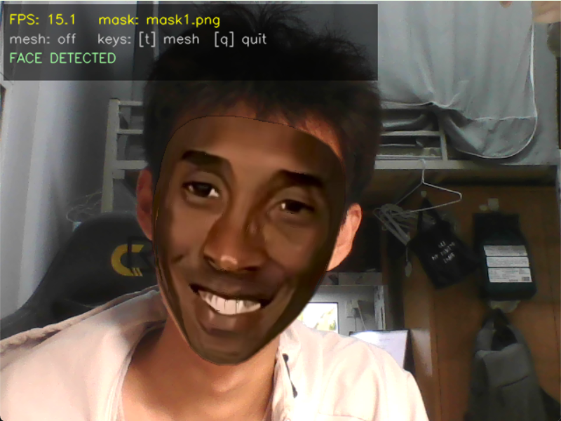
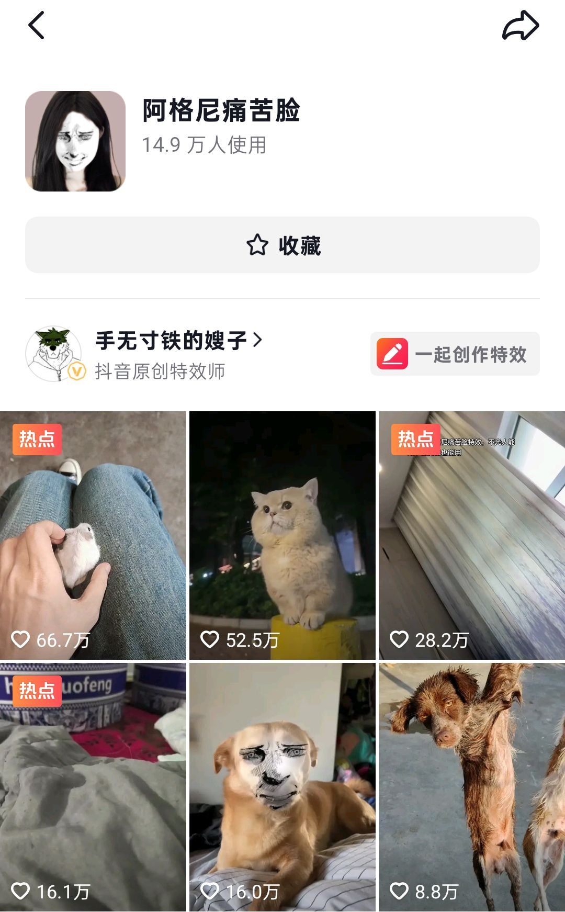
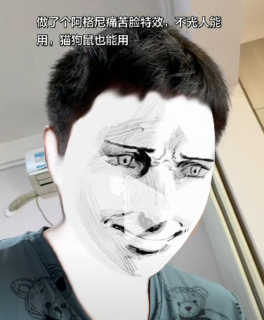

## 一、背景与意义

​	在抖音等短视频平台中，在视频创作方面存在各种各样的特效，其中有一种特效便是人脸特效，而在人脸特效中，除开美颜（磨皮、大眼、美白）这些特效，有一细分特效就是人脸替换特效，一个好的人脸替换特效使用人数能达到10w+，浏览量以亿计[^1]。本实践以抖音特效“阿格尼痛苦脸”[^2]为出发点，尝试运用数字图像技术从零实现该特效，目的旨在理解人脸替换特效背后的原理、提升自己本门课程的实践能力、同时为制作相关爆款特效打下基础。

## 二、实现过程

### v1 “较为生硬的人脸贴图”

1. 目标： 实现照片/视频上简单叠加痛苦脸，覆盖人脸检测 + 基本变换 + 融合。

2. 核心原理：

   - 人脸检测与关键点：MediaPipe使用深度学习（CNN + 回归）实时输出468个3D landmarks（x,y归一化坐标[^7]）。

   - 几何变换：仿射变换（Affine Transform）保留平行线，包含缩放、旋转、平移。2D图像中的仿射变换公式：

     $\begin{pmatrix} x' \\ y' \end{pmatrix} = \begin{pmatrix} a & b \\ c & d \end{pmatrix} \begin{pmatrix} x \\ y \end{pmatrix} + \begin{pmatrix} e \\ f \end{pmatrix}$[^3]

   - 图像融合： Alpha混合（线性加权）对于每个像素，融合公式如下：

     $\text{Result} = (1 - \alpha) \times \text{Background} + \alpha \times \text{Foreground}$[^4]

   - 视频帧处理（流程）： 摄像头帧 → MediaPipe 检测人脸关键点[^6] → 计算 mask[^5] 到人脸的仿射变换→ 将 mask 变形对齐 → Alpha 混合叠加 → 显示结果

3. 原理分析：

   - 对MediaPipe的理解：

     - 什么是MediaPipe：MediaPipe 是 Google 推出的**跨平台、多媒体机器学习框架**（开源），专门用于实时感知任务（Perception Pipelines）。

       它内置了很多现成的**管道（Pipeline）**，其中最常用的是 **Face Mesh（人脸网格）** 模型

     - MediaPipe的作用：MediaPipe 承担了项目中最关键、最难的一步 —— 人脸特征提取与配准。它实时检测人脸的位置和姿态，提供高精度关键点（归一化坐标），可以说是此项目的基石。

     - 为什么用MediaPipe：MediaPipe检测点数多，具有高精度、鲁棒性，可以适应不同光照、角度、表情。

     - MediaPipe Face Mesh简要工作流：

       - 人脸检测（Face Detection）—— 找到人脸大致位置
       - 关键点回归（Landmark Regression）—— 预测 468 个点的坐标
       - 3D 网格拟合（3D Mesh Fitting）—— 结合先验模型优化得到 3D 关键点
       - 跟踪（Tracking）—— 帧间保持稳定性

   - `a`、`b`、`c`、`d`、`e`、`f` 六个参数的理解:

     - 定性分析：通过实时的输出6各参数的值对照我头部的运动，我知道了a和d大致代表了缩放大小，e、f即是位移，而b、c则是控制了旋转角度

     - 定量分析：

       仅凭定性观察无法把「缩放/旋转/剪切」严格分离——例如 `a` 同时受缩放和旋转影响。要从 6 个原始参数中定量还原出各几何量，需要对仿射矩阵做**矩阵分解**。按本报告约定 $x'=a x + b y + e,\; y'=c x + d y + f$，其线性部分为 $M=\begin{pmatrix} a & b \\ c & d \end{pmatrix}$，两列 $\mathbf{u}_1=(a,c)^\top,\ \mathbf{u}_2=(b,d)^\top$ 正是 $x$、$y$ 单位基向量变换后的像。对 $M$ 的列做 Gram–Schmidt 正交化即得 QR 分解 $M=R(\theta)\cdot K$，其中 $R$ 为旋转、$K$ 为上三角的「缩放+剪切」矩阵[^12][^13]，从而把各几何参数逐一解析出来：

       - **平移** $t_x=e,\ t_y=f$（像素），直接读取，是位置偏差的主要来源。

       - **旋转角** $\theta=\operatorname{atan2}(c,\,a)$，即第一列向量 $\mathbf{u}_1$ 与 $x$ 轴的夹角（歪头角度）。

       - **$x$ 方向缩放** $s_x=\lVert \mathbf{u}_1\rVert=\sqrt{a^2+c^2}$，即第一列向量的长度。

       - **行列式** $\Delta=\det M=ad-bc$，其绝对值 $|\Delta|=s_x s_y$ 为**面积缩放因子**；$\Delta<0$ 表示发生了**镜像翻转**（左右手性改变）。

       - **$y$ 方向缩放** $s_y=\dfrac{\Delta}{s_x}=\dfrac{ad-bc}{\sqrt{a^2+c^2}}$，即第二列去除与第一列平行分量后的长度。

       - **剪切（skew）** $\varphi=\arctan\!\dfrac{a b + c d}{a^2+c^2}$，其中 $ab+cd=\mathbf{u}_1\!\cdot\!\mathbf{u}_2$ 为两列的内积，衡量两基向量偏离正交的程度。

       特别地，当变换为**相似变换**（只含等比缩放+旋转、无剪切）时两列彼此正交且等长，故 $\mathbf{u}_1\!\cdot\!\mathbf{u}_2=ab+cd=0\Rightarrow\varphi=0$，且 $\Delta=s_x s_y=s^2$，于是 $s_x=s_y=s=\sqrt{\Delta}$。此时分解退化为「缩放 = 第一列长度、旋转 = 第一列方向角、平移 = $(e,f)$」，这正对应了上面定性观察到的结论；而完整的 QR 分解则在存在非等比缩放或剪切时依然成立，是更普适的定量刻画。

       **数值示例**：设某帧测得 $M=\begin{pmatrix} 1.159 & -0.311 \\ 0.311 & 1.159 \end{pmatrix},\ (e,f)=(320,240)$，代入上式：$s_x=\sqrt{1.159^2+0.311^2}=1.200$，$\theta=\operatorname{atan2}(0.311,1.159)=15.0^\circ$，$\Delta=1.159^2-(-0.311)(0.311)=1.440$，$s_y=1.440/1.200=1.200$，$ab+cd=0\Rightarrow\varphi=0^\circ$。即该帧表示「痛苦脸线稿等比放大 1.2 倍、顺时针歪头 15°、无剪切、平移到 $(320,240)$」，与实际头部姿态一致，验证了上述分解的正确性。

       > 补充：OpenCV 中 `cv2.getAffineTransform` / `cv2.estimateAffinePartial2D` 返回的即是 $\begin{pmatrix} a & b & e \\ c & d & f \end{pmatrix}$ 这一 $2\times3$ 矩阵；v1 中 6 对点通过最小二乘拟合得到完整仿射（含剪切），v2 逐三角片则由 3 对点唯一确定一个仿射。对每帧矩阵套用上述分解公式，即可实时监控缩放/旋转/剪切是否处于合理范围，用于判断跟踪是否发散。

     

4. 问题及解决：

   - 问题：mask未能覆盖全脸

   - 原因分析：mask上左眼、右眼、鼻子、左嘴角、右嘴角、下巴这六对对应点没有标注好

   - 解决：开发一个可视化 mask 关键点辅助调整工具，标记对应点

     

   - 最终效果：

     

     

5. 局限性：边缘不自然（仿射是全局变换，无法很好处理脸部的局部非刚性变形（眉毛、嘴巴的独立运动））

### v2"基于三角剖分的非刚性变形"

1. 目标：针对 v1 的局限，让 mask 能跟随眉毛、嘴角等脸部局部运动，实现更自然贴合的非刚性形变。

2. 实现思路：

   - 在v1中仅用六队点你和一个全局相似的变换矩阵，生硬的把整张mask“贴”到脸上，即，整张 mask 被同一个矩阵刚性地缩放、旋转、平移，因此只能跟随整体的跟随头部运动，无法显示出五官各自的运动。
   - 想要实现上面一点就需要更多的点来进行拟合，最开始我尝试手工进行标注，但是结果较为糟糕，当标注点的个数提升到20-30的时候，手工标注就较为混乱，因此需要一种更为高效的方法来标注mask中的各个点来时其与人脸一一对应。
   - 这是我注意到，既然MediaPipe中的模型能识别人脸从而得出各个关键点，而mask又是一张漫画风格的人脸，我是否可以借用其模型也顺便标注好mask中的各个关键点呢。
   - 经过测试我用MediaPipe中的模型标注好输出了如下图片，如图可以看到我的想法是可行的！模型的标注效果极好。

   

   - 接下来，v2采用 MediaPipe 输出的 468 个关键点，把人脸划分成数百个小三角形，每个三角形单独求一个仿射矩阵。当这些三角形各自变换后拼接在一起时，整体就以「分段线性」的方式逼近任意非刚性形变。

3. 核心原理：
   - 密集对应点：MediaPipe FaceLandmarker 对一张人脸稳定输出带**固定编号**的 468 个网格点（第 $i$ 号点恒为同一语义位置，如左眼内角）。由于编号语义一致，mask 上的第 $i$ 点与摄像头人脸上的第 $i$ 点天然一一对应，无需手工配准——这正是把对应点从 v1 的 6 对自动扩充到 468 对的关键。经实测，MediaPipe 也能在手绘 mask 线稿上稳定检出 468 点（经实测，将 mask 白底合成后，在 30 次重复检测中人脸关键点检出率为 100%（30/30），说明 MediaPipe 可稳定用于 mask 的密集对应点获取。）。
   - Delaunay 三角剖分[^8]：在点集上计算三角剖分，得到“哪三个编号的点连成一个三角形”的**拓扑**（一组编号三元组 $(i,j,k)$，只含编号、不含坐标）。Delaunay 剖分具有**最大化最小角**[^9]的性质，能尽量避免狭长（病态）三角形，使后续逐片仿射更稳定。因 mask 静止且两侧编号通用，该拓扑**只需在 mask 点集上计算一次并缓存**，人脸每帧仅坐标变化、复用同一套拓扑
   - 分片仿射（piecewise affine）：对每个三角形，用 mask 上的三个顶点 $\to$ 人脸上同编号三个顶点，由 `getAffineTransform` 解出该片的 2×3 仿射矩阵（3 对点恰好唯一确定一个仿射变换），再用 `warpAffine` 把该三角形内的图像变形对齐；配合一张三角形掩膜（`fillConvexPoly`）只保留三角形内部像素，逐片累积即得到非刚性变形后的整张 mask。
   - 图像融合：仍采用 Alpha 混合 $\text{Result} = (1-\alpha)\cdot\text{Background} + \alpha\cdot\text{Foreground}$；并对合成用的 Alpha 通道做轻微高斯模糊（羽化），缓解贴图外边界的硬边，使过渡更自然 ，这里选用5×5 核，模糊范围很小，只修边。
4. 实现要点：
   - 视频帧处理流程：摄像头帧 → MediaPipe 检测 468 点 → 按编号与 mask 点一一对应 → 遍历缓存的三角形拓扑做分片仿射 → Alpha 羽化混合 → 显示。
   - 性能优化：每个三角形只占画面一小块，若对整张图做 `warpAffine` 十分浪费。实现中先用 `boundingRect` 取目标三角形的**包围盒**[^11]，仅在该小块 ROI [^10]内做变换与掩膜填充再贴回画布；数百个三角形累加时这是维持实时帧率的关键。

5. 问题及解决：

   - 问题：程序运行中突然退出，之后再次启动却无法打开摄像头。下面为具体现象：

     - 程序启动正常：能加载 mask 缓存、完成 Delaunay 三角剖分（897 个三角形）、打开摄像头窗口。
     - 在**头部转向两侧（大角度侧脸）**测试时，窗口突然消失，程序异常退出。
     - 终端通常没有 Python 报错栈（traceback），只有 MediaPipe 的正常启动日志。
     -  崩溃后无法再次启动，摄像头被占用

   - 原因：

     - 大角度侧脸时，MediaPipe 会把部分关键点外推到画面外很远，某个三角形的包围盒变得极大。旧代码按完整包围盒尺寸做 `warpAffine`，会尝试分配超大图像（内存爆炸），触发 OpenCV 底层崩溃；终端往往没有 Python 报错栈。
     - 程序异常退出后，摄像头未被释放，残留 `python.exe` 仍占用设备，再次运行就报「无法打开摄像头」。这是崩溃的后果，不是独立故障。

   - 解决：

     - 包围盒与画面求交后再 warp，使`warpAffine` 输出尺寸不超过画面，从根上避免超大内存分配。这相当于给ROI加了一个上界。

   - 实现效果：

     

6.其他问题：笔记本电脑的摄像头坏掉了，经检查是排线松动导致检测不到硬件，为了保证项目的推进，使用Iriun Webcam来连接手机和电脑，借用手机的摄像头使用

### v2.1“其他脸部的支持”

1. 优化如下

   - 性能方面除了把points写入缓存后，还把做好的三角剖分拓扑写入缓存，提升了启动速度

   - 基于v2发现MediaPipe可自动标注关键点，由此优化支持不同的人脸轮廓mask，如下图

     

## 三、后续迭代方向

1. 在468个关键点中只取五官附近的关键点，这样渲染的部分变少了，可提升性能，现在是15fps。
2. 如果像阿格尼痛苦脸这种漫画线稿，只渲染五官，其余部分用白色填充也可达到很好的效果，就如导入时的抖音特效一样。
3. 实现热切换。
4. 制作GUI界面，方便用户交互。

注：除开迭代方向，我后边或许会抽时间整理后将其发布到抖音短视频平台。

##  四、心得与体会（收获）

1. 本项目是我一个人借助ai工具实现，对于ai的使用，在你完全阅读他干了什么之前，确实应该保持100%的怀疑，不要完全相信，在该项目中关于对阿尔法通道（透明通道）高斯模糊（羽化）部分，ai告诉我这有利于不同的三角剖分之间的整合，但是我给的png图片中间部分的透明度都是1，即完全不透明，即使做了高斯模糊也没任何效果，当我发现并质问时，ai说它搞错了。
2. 关于团队合作，最开始我是和4个人组成一队的，但是大家目的不一致吧，标准不同，整个团队如同一盘散沙，达到了1+1<1的效果，由此我便决定退出一个人做该课程的项目。我觉得在现在各种工具辅助办公、编码的背景下，探索新的团队协作模式是有必要的。还有，选择队友一定一定一定要慎重。
3. 关于本课程，虽然没有完全搞懂课程上的所有内容，但是我在宏观上对数字图像处理有了把握，这有利于后续深入的学习。
4. 十分感谢本课程的老师，她积极引导同学正确利用ai工具提高效率，同时对同学的高标准也得以让我重新审视自己在做的项目，究竟是混过去，还是真的从中收获了东西。
5. 总之，十分开心能借助本次项目的机会去探索我感兴趣的部分，这次对于网络特效的复现并不完美，还有很多不足的方面，我会继续做的更好的。

[^1]: 按照点赞和浏览量1:100计算，那么前几个热度高的视频有百万级别的点赞，浏览量至少在1个亿以上 

[^2]: 该抖音特效具体的效果如图
[^3]: **a, d**：控制痛苦脸线稿的**整体缩放**（脸大就放大mask，脸小就缩小）。**b, c**：处理轻微**旋转和倾斜**（当你歪头时，线稿跟着倾斜）。**e, f**：把线稿**移动**到你的脸所在位置（最直观的影响，通常是位置偏差的主要来源）。
[^4]: α 是归一化后的Alpha值（0~1）,Background 是原始视频帧（你的脸）,Foreground 是变形后的痛苦脸mask

[^5]:  即为痛苦脸
[^6]:  选取六对点，让变换更稳定（最小二乘拟合），因为有变换矩阵由6个未知数至少要3对点，写出6个方程来
[^7]:  返回的坐标是相对于图像宽高的比例（0~1），我们再乘以图像实际宽高转为像素坐标，可便于后续几何变换。
[^8]: Delaunay 三角剖分（Delaunay Triangulation）是一种把平面上很多点，连成一张三角网格的方法。
[^9]:最大化最小角,意思是：它会尽量让三角形不要又细又长，而是尽量接近“比较匀称”的三角形,为什么这很重要？如果一个三角形特别狭长，做仿射变换时很容易变形失真、数值不稳定。Delaunay 剖分能尽量避免这种“坏三角形”，让后续分片仿射更稳。
[^10]:Region of Interest，感兴趣区域
[^11]:三角形有 3 个顶点。包围盒就是能刚好包住这 3 个点的最小轴对齐矩形（边平行于 x、y 轴）。`cv2.boundingRect(dst_tri)` 求目标包围盒 `(dx, dy, dw, dh)`

[^12]: Spencer W. Thomas. *Decomposing a Matrix into Simple Transformations*. In: James Arvo (ed.), Graphics Gems II, §VII.1, Academic Press, 1991, pp. 320–323. 该文给出仿射矩阵按「平移·旋转·缩放·剪切」分解的经典算法（列向量 Gram–Schmidt / QR 思路）。

[^13]: Frédéric Wang. *Decomposition of 2D-transform matrices*. 2013. https://frederic-wang.fr/2013/12/01/decomposition-of-2d-transform-matrices/ ，给出 SVG `matrix(a,b,c,d,e,f)` 的 QR 分解闭式解 `translate·rotate·scale·skewX`；相似变换情形可参 Ken Shoemake, Tom Duff. *Matrix Animation and Polar Decomposition*. Proc. Graphics Interface '92, 1992, pp. 258–264（极分解 $M=QS$，$Q$ 为旋转、$S$ 为对称拉伸）。另参 OpenCV 官方文档 `cv2.getAffineTransform` / `cv2.estimateAffinePartial2D`。
